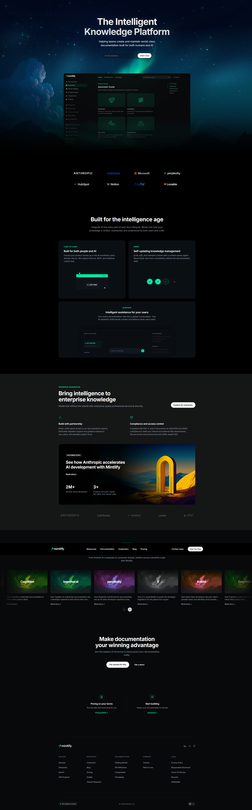

# Documentation Website - Mintlify Clone

A desktop-first documentation-style website inspired by the Mintlify website built for the Web Dev Cohort 2026 assignment.

## Overview
This project focuses on recreating the structure, layout, typography, and aesthetics of the original Mintlify website using **only pure HTML and CSS**. It strictly adheres to all constraints, including the absence of JavaScript, AI generation tools, or CSS frameworks like TailwindCSS.

### Sections Recreated
As per the assignment requirements, the following sections from the original design were faithfully recreated:
1. **Top Navigation Bar**: Logo, navigation links, and primary CTA.
2. **Hero Section**: Main headline, short description, email input with CTA button, and the large background visual.
3. **Documentation Preview Section**: Sidebar-style navigation (static) with main content cards.
4. **Trusted By / Logos**: A row of featured company logos.
5. **Feature Highlights**: Two-column layout featuring text and custom CSS-drawn visual components.
6. **Intelligent Assistant / UI Preview**: A comprehensive UI mockup representing the AI features.
7. **Enterprise Features Section**: Custom feature blocks detailing security, compliance, and enterprise features.
8. **Case Studies / Customer Stories**: A card-based layout featuring customer imagery and metrics.
9. **Final Call-To-Action**: A bold heading with dual CTA buttons.
10. **Footer**: Pre-footer action cards, a multi-column links grid, company/legal info, theme toggles, and system status indicator.

## Design System

### Fonts Used
The website utilizes a modern, clean typography stack to closely match the brand identity:
- **Primary Typeface**: `Inter`, `system-ui`, `-apple-system`, `sans-serif`
- **Weights Used**: Regular (400), Medium (500), SemiBold (600), Bold (700), ExtraBold (800)

### Color Palette
The color scheme was precisely extracted to match the reference site:
- **Background Dark**: `#08090A` / `#000000` / `#0D1218`
- **Accent Green**: `#12B57A`
- **Text Primary (White)**: `#FFFFFF`
- **Text Secondary (Light Gray)**: `#9CA3AF`
- **Text Muted (Dark Gray)**: `#6B7280`
- **Borders & Dividers**: Ranging from `rgba(255, 255, 255, 0.05)` to `rgba(255, 255, 255, 0.1)`

## Screenshots
*(Below is the reference screenshot of the final output)*

## Constraints Followed
- ✅ **Tech Stack**: Only HTML and CSS used.
- ✅ **No JavaScript**: All interactivity (like hover states and sliders) is achieved utilizing pure CSS.
- ✅ **No Frameworks**: Completely custom CSS without TailwindCSS or Bootstrap.
- ✅ **Desktop-First**: Focused purely on desktop structure and readability as required.
- ✅ **High Fidelity**: Spacing, typography, and layout match the original design with structural accuracy.
